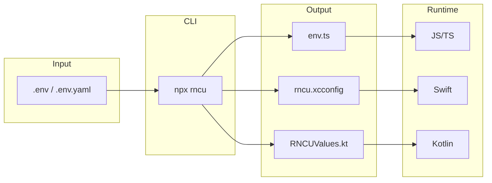

<p align="center">
  
</p>

<h1 align="center">react-native-config-ultimate</h1>

<p align="center">
  <strong>Environment variables for React Native that just work.</strong>
  <br />
  <strong>iOS</strong> &bull; <strong>Android</strong> &bull; <strong>Web</strong> &bull; <strong>Old & New Architecture</strong>
</p>

<p align="center">
  <a href="https://www.npmjs.com/package/react-native-config-ultimate">
    
  </a>
  <a href="https://www.npmjs.com/package/react-native-config-ultimate">
    
  </a>
  <a href="./LICENSE">
    
  </a>
  <a href="https://www.typescriptlang.org/">
    
  </a>
</p>

<p align="center">
  <a href="./docs/quickstart.md"><strong>Getting Started</strong></a> &nbsp;•&nbsp;
  <a href="./docs/api.md"><strong>API Reference</strong></a> &nbsp;•&nbsp;
  <a href="./docs/cookbook.md"><strong>Cookbook</strong></a> &nbsp;•&nbsp;
  <a href="https://github.com/javier545dev/react-native-config-ultimate/issues"><strong>Report Bug</strong></a>
</p>

---

## The Problem

Managing environment variables in React Native is painful:

```
❌ Different config files for iOS and Android
❌ Separate setup for each platform
❌ Type-unsafe string values
❌ No support for New Architecture
❌ Existing solutions are unmaintained
```

## The Solution

**One config file. Every platform. Type-safe. Just works.**

```bash
# Create your config
echo "API_URL=https://api.myapp.com" > .env

# Generate for all platforms
npx rncu .env

# Use everywhere ✨
```

```tsx
import Config from 'react-native-config-ultimate';

// TypeScript knows your config shape!
console.log(Config.API_URL); // https://api.myapp.com
```

---

## Why Choose This Library?

<table>
<tr>
<th width="33%">🚀 Modern</th>
<th width="33%">📱 Universal</th>
<th width="33%">🛡️ Type-Safe</th>
</tr>
<tr>
<td>

- New Architecture ready
- TurboModules support
- React Native 0.73+
- React 18 & 19

</td>
<td>

- iOS (Swift, Obj-C)
- Android (Kotlin, Java)
- Web (RN Web, Vite)
- Expo compatible

</td>
<td>

- Auto-generated `.d.ts`
- Strict TypeScript
- Schema validation
- Zero `any` types

</td>
</tr>
</table>

### Comparison

| Feature | react-native-config-ultimate | react-native-config | react-native-dotenv |
|---------|:----------------------------:|:-------------------:|:-------------------:|
| **New Architecture** | ✅ | ❌ | ❌ |
| **React Native 0.79+** | ✅ | ⚠️ | ⚠️ |
| **Web support** | ✅ | ❌ | ✅ |
| **YAML config** | ✅ | ❌ | ❌ |
| **Per-platform values** | ✅ | ❌ | ❌ |
| **Type-safe** | ✅ | ⚠️ | ⚠️ |
| **Multi-env merging** | ✅ | ❌ | ❌ |
| **Schema validation** | ✅ | ❌ | ❌ |
| **Native code access** | ✅ | ✅ | ❌ |
| **Active maintenance** | ✅ | ⚠️ | ⚠️ |

---

## Quick Start

### 1. Install

```bash
npm install react-native-config-ultimate
# or
yarn add react-native-config-ultimate
# or
pnpm add react-native-config-ultimate
```

### 2. Create config file

**Option A: `.env` (simple)**
```bash
API_URL=https://api.myapp.com
APP_NAME=MyApp
DEBUG_MODE=true
VERSION=1.0.0
```

**Option B: `.env.yaml` (powerful)**
```yaml
API_URL: https://api.myapp.com
APP_NAME: MyApp
DEBUG_MODE: true
VERSION: 1.0.0

# Per-platform values 🎯
APP_ICON:
  ios: AppIcon
  android: ic_launcher
```

### 3. Setup native projects

📱 **iOS** — [Setup Guide](./docs/quickstart.md#ios-setup)  
🤖 **Android** — [Setup Guide](./docs/quickstart.md#android-setup)

### 4. Generate & use

```bash
npx rncu .env
# or
npx rncu .env.yaml
```

```tsx
import Config from 'react-native-config-ultimate';

function App() {
  return (
    <View>
      <Text>API: {Config.API_URL}</Text>
      <Text>Version: {Config.VERSION}</Text>
      {Config.DEBUG_MODE && <Text>🐛 Debug Mode</Text>}
    </View>
  );
}
```

**That's it!** Full guide: [**Quickstart →**](./docs/quickstart.md)

---

## Features

<details>
<summary><strong>📁 Multi-Environment Support</strong></summary>

Merge multiple env files — great for staging, production, etc:

```bash
npx rncu .env.base .env.staging
```

Later values override earlier ones.

</details>

<details>
<summary><strong>🔗 Variable Expansion</strong></summary>

Reference other variables:

```bash
BASE_URL=https://api.myapp.com
API_URL=$BASE_URL/v1
AUTH_URL=$BASE_URL/auth
```

</details>

<details>
<summary><strong>✅ Schema Validation</strong></summary>

Fail fast if required vars are missing:

```js
// .rncurc.js
module.exports = {
  schema: {
    API_URL: { type: 'string', required: true },
    DEBUG_MODE: { type: 'boolean', default: false },
  }
};
```

</details>

<details>
<summary><strong>🎯 Per-Platform Values</strong></summary>

Different values for iOS/Android/Web:

```yaml
APP_STORE_URL:
  ios: https://apps.apple.com/app/myapp
  android: https://play.google.com/store/apps/details?id=com.myapp
  web: https://myapp.com
```

</details>

<details>
<summary><strong>🪝 Hooks API</strong></summary>

Transform values at build time:

```js
// .rncurc.js
module.exports = {
  on_env: (env) => ({
    ...env,
    BUILD_TIME: new Date().toISOString(),
  })
};
```

</details>

<details>
<summary><strong>👀 Watch Mode</strong></summary>

Auto-regenerate on changes:

```bash
npx rncu .env --watch
```

</details>

---

## How It Works



---

## Access Everywhere

Your config is available in every layer of your app:

```
┌─────────────────────────────────────────────────────────┐
│                                                         │
│              JavaScript / TypeScript                    │
│                   Config.API_URL                        │
│                                                         │
├────────────────────────┬────────────────────────────────┤
│                        │                                │
│   Swift / Objective-C  │       Kotlin / Java            │
│   UltimateConfig       │       BuildConfig              │
│      .API_URL          │         .API_URL               │
│                        │                                │
├────────────────────────┼────────────────────────────────┤
│                        │                                │
│   Xcode Build Settings │   AndroidManifest.xml          │
│   $(API_URL)           │   ${API_URL}                   │
│   Info.plist           │   build.gradle                 │
│                        │                                │
└────────────────────────┴────────────────────────────────┘
```

**Examples:**

```swift
// Swift
let apiUrl = UltimateConfig.API_URL
```

```kotlin
// Kotlin
val apiUrl = BuildConfig.API_URL
```

```xml
<!-- AndroidManifest.xml -->
<meta-data android:name="api_url" android:value="${API_URL}" />
```

---

## Compatibility

| Version | React Native | React | Gradle | Architecture |
|:-------:|:------------:|:-----:|:------:|:------------:|
| **0.2.x** | ≥ 0.73 | ≥ 18 | ≥ 8 | ✅ New (TurboModules) |

> **Need older RN support?** See [`react-native-ultimate-config`](https://github.com/maxkomarychev/react-native-ultimate-config)

---

## Documentation

| 📖 Guide | Description |
|:---------|:------------|
| [**Quickstart**](./docs/quickstart.md) | Installation and setup |
| [**API Reference**](./docs/api.md) | JavaScript, native code, build tools |
| [**Migration Guide**](./docs/migration.md) | From react-native-config |
| [**Cookbook**](./docs/cookbook.md) | Common patterns and recipes |
| [**Testing**](./docs/testing.md) | Mocking Config in tests |
| [**Monorepo Tips**](./docs/monorepo-tips.md) | pnpm, yarn workspaces, Lerna |
| [**Troubleshooting**](./docs/troubleshooting.md) | Common issues and solutions |

---

## Examples

| Project | React Native | Platforms | Description |
|:--------|:------------:|:---------:|:------------|
| [**example**](./packages/example) | 0.83 | iOS, Android | Full native app with YAML |
| [**Example079**](./packages/Example079) | 0.79 | iOS, Android, Web | Native + Vite web |
| [**example-web**](./packages/example-web) | — | Web | Standalone Vite + RN Web |

---

## Frequently Asked Questions

<details>
<summary><strong>Do I need to rebuild after changing .env?</strong></summary>

**JavaScript**: No, just re-run `npx rncu .env` and reload the app.

**Native values** (Info.plist, AndroidManifest): Yes, you need to rebuild.

</details>

<details>
<summary><strong>Can I use this with Expo?</strong></summary>

Yes! Works with Expo managed and bare workflows. See [Expo setup](./docs/quickstart.md#expo).

</details>

<details>
<summary><strong>How do I use different configs for dev/staging/prod?</strong></summary>

Use multi-file merging:
```bash
npx rncu .env.base .env.production
```

Or use separate commands in your package.json:
```json
{
  "scripts": {
    "env:dev": "rncu .env.dev",
    "env:prod": "rncu .env.prod"
  }
}
```

</details>

<details>
<summary><strong>Is this library actively maintained?</strong></summary>

Yes! This is a community fork that adds New Architecture support, React 19 compatibility, and ongoing maintenance. See [CONTRIBUTING.md](./CONTRIBUTING.md).

</details>

---

## Contributing

We welcome contributions! See [CONTRIBUTING.md](./CONTRIBUTING.md) for guidelines.

```bash
git clone https://github.com/javier545dev/react-native-config-ultimate.git
cd react-native-config-ultimate
pnpm install
pnpm test
pnpm build
```

---

## Credits

<table>
<tr>
<td align="center">
  <strong>Original Author</strong><br/>
  <a href="https://github.com/maxkomarychev">Max Komarychev</a><br/>
  <sub>Creator of react-native-ultimate-config</sub>
</td>
<td align="center">
  <strong>Current Maintainer</strong><br/>
  <a href="https://github.com/javier545dev">javier545dev</a><br/>
  <sub>New Architecture & React 19 support</sub>
</td>
</tr>
</table>

> This is a community-maintained fork of [`react-native-ultimate-config`](https://github.com/maxkomarychev/react-native-ultimate-config). Full credit to Max for the original design and years of maintenance. The MIT license is preserved.

---

## License

MIT License — see [LICENSE](./LICENSE) for details.

---

<p align="center">
  <strong>If this library helps you, consider giving it a ⭐️</strong>
  <br/><br/>
  <a href="https://github.com/javier545dev/react-native-config-ultimate">
    
  </a>
</p>

<p align="center">
  <a href="./docs/quickstart.md"><strong>Get Started →</strong></a>
</p>
