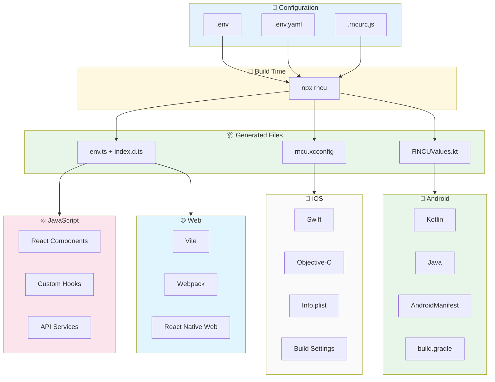
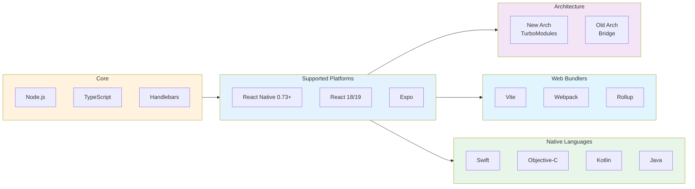

# react-native-config-ultimate

**Environment variables for React Native that just work.**


> **Note:** v0.2.0 is the first stable release. Versions `<0.2.0` are deprecated and should not be used.

---

## Quick Links

- [**Quick Start**](./quickstart.md) — Get up and running in 5 minutes
- [**API Reference**](./api.md) — Full API documentation
- [**Cookbook**](./cookbook.md) — Common patterns and recipes
- [**Migration Guide**](./migration.md) — Coming from react-native-config?
- [**Alternatives**](./alternatives.md) — Comparison with other libraries

---

## Why This Library?

| Feature | react-native-config-ultimate | react-native-config | react-native-dotenv |
|---------|:----------------------------:|:-------------------:|:-------------------:|
| **New Architecture** | ✅ | ❌ | ❌ |
| **Old Architecture** | ✅ | ✅ | ✅ |
| **React Native 0.73+** | ✅ | ⚠️ | ⚠️ |
| **React 18/19** | ✅ | ⚠️ | ⚠️ |
| **Web support (Vite + RN Web)** | ✅ | ❌ | ✅ |
| **YAML config** | ✅ | ❌ | ❌ |
| **Per-platform values** | ✅ | ❌ | ❌ |
| **Multi-env merging** | ✅ | ❌ | ❌ |
| **Variable expansion** | ✅ | ❌ | ❌ |
| **Schema validation** | ✅ | ❌ | ❌ |
| **Auto-generated TypeScript types** | ✅ | ⚠️ Manual | ⚠️ |
| **Monorepo support** | ✅ | ⚠️ | ⚠️ |
| **Active maintenance (2024+)** | ✅ | ⚠️ | ⚠️ |

---

## Compatibility

| Library Version | React Native | React | Gradle | Architecture |
|:---------------:|:------------:|:-----:|:------:|:------------:|
| **0.2.x** | ≥ 0.73 | 18 / 19 | ≥ 8 | Old & New (TurboModules) |

> This library is a community-maintained fork of [`react-native-ultimate-config`](https://github.com/maxkomarychev/react-native-ultimate-config) with New Architecture support, bug fixes, and active maintenance.

---

## Installation

```bash
npm install react-native-config-ultimate
# or
yarn add react-native-config-ultimate
# or
pnpm add react-native-config-ultimate
```

## Basic Usage

```bash
# Create config
echo "API_URL=https://api.myapp.com" > .env

# Generate for all platforms
npx rncu .env
```

```tsx
import Config from 'react-native-config-ultimate';

console.log(Config.API_URL); // https://api.myapp.com
```

---

## How It Works



**The flow:**
1. **Configuration** — Define your env vars in `.env`, `.env.yaml`, or both
2. **Build Time** — Run `npx rncu .env` to generate platform files
3. **Generated Files** — TypeScript types, iOS xcconfig, Android Kotlin
4. **Runtime** — Access values in any layer of your app

---

## Technology Stack



---

## Key Features

| Feature | Description |
|:--------|:------------|
| **Multi-env merging** | `npx rncu .env.base .env.staging` — merge multiple files |
| **Variable expansion** | `API_URL=$BASE_URL/v1` — reference other variables |
| **Per-platform values** | YAML: `API_KEY: { ios: "abc", android: "xyz", web: "123" }` |
| **Schema validation** | Fail at build time if required vars are missing |
| **Auto TypeScript types** | `index.d.ts` generated automatically |
| **Watch mode** | `npx rncu .env --watch` — auto-regenerate on changes |

### Platforms Supported

| Platform | Native Access | JS Access | Build Integration |
|:---------|:-------------:|:---------:|:-----------------:|
| **iOS** | Objective-C, Swift, Info.plist | ✅ | xcconfig, Build Settings |
| **Android** | Java, Kotlin, BuildConfig | ✅ | Gradle, Manifest placeholders |
| **Web** | N/A | ✅ | Vite, Webpack, Rollup, Parcel |

---

## Documentation

| Guide | Description |
|:------|:------------|
| [Quick Start](./quickstart.md) | Installation and setup |
| [API Reference](./api.md) | JavaScript, native code, build tools |
| [Cookbook](./cookbook.md) | Common patterns and recipes |
| [Migration](./migration.md) | From react-native-config |
| [Testing](./testing.md) | Mocking Config in tests |
| [Monorepo Tips](./monorepo-tips.md) | pnpm, yarn workspaces, Lerna, Nx |
| [Troubleshooting](./troubleshooting.md) | Common issues and solutions |
| [Alternatives](./alternatives.md) | Comparison with other libraries |
| [Contributor Notes](./contributor-notes.md) | For contributors |

---

## Links

- [GitHub Repository](https://github.com/AuxStudio/react-native-config-ultimate)
- [npm Package](https://www.npmjs.com/package/react-native-config-ultimate)
- [Report an Issue](https://github.com/AuxStudio/react-native-config-ultimate/issues)
- [Changelog](https://github.com/AuxStudio/react-native-config-ultimate/blob/master/CHANGELOG.md)

---

## About

This library is a community-maintained fork of [`react-native-ultimate-config`](https://github.com/maxkomarychev/react-native-ultimate-config) by Max Komarychev. We've added New Architecture support, React 18/19 compatibility, Web support (Vite + React Native Web), and continue active maintenance.

MIT License
